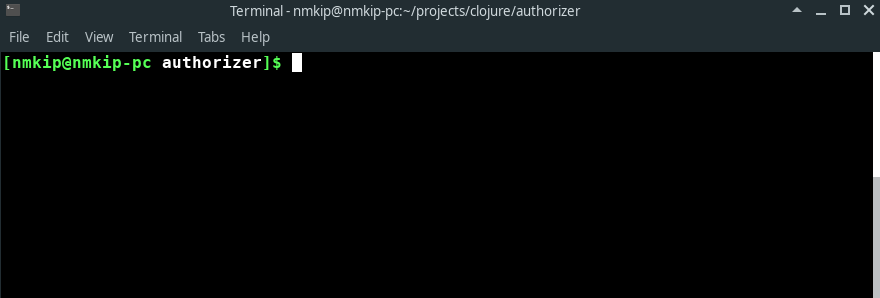
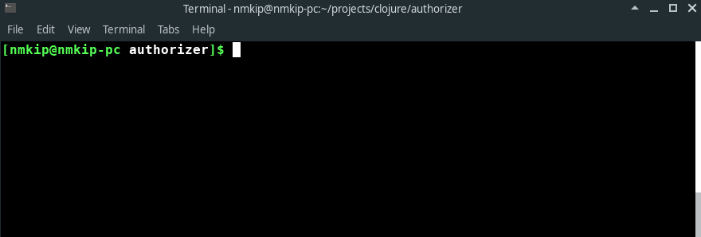

## Getting Started
### Requirements
- [Clojure](https://clojure.org/guides/getting_started)
- Java 1.8 or higher

### Running the program

To use the program go to the project folder and execute the following command:

    clojure -m authorize.main < input.json

#### Sample usage

### Running the tests

To run the tests go the project folder and execute the following command:

    clojure -Atest:runner

#### Sample usage

